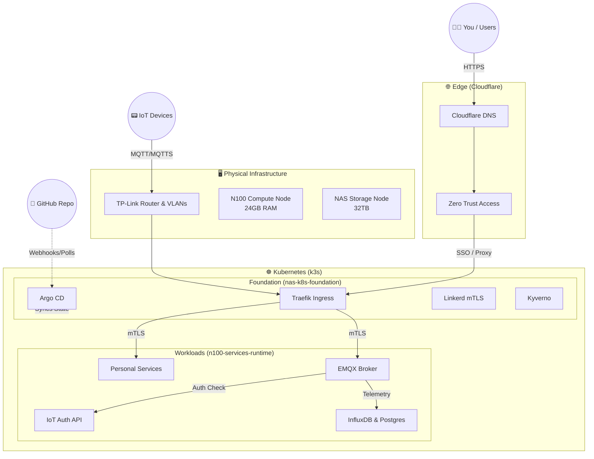

# 🌍 Home Platform Engineering DevOps

Welcome to the Home Platform Engineering Monorepo. This repository acts as the central hub for our fully automated, GitOps-driven infrastructure, platform foundation, and runtime workloads.

## 📍 Where to Start

The platform is structured into three distinct layers, each separated into its own directory for clear isolation of concerns:

1. **[Infrastructure Provisioning (`nas-infra-provisioning/`)](./nas-infra-provisioning/README.md)**
   The "Hardware & Edge" layer. This handles physical bootstrapping (Ansible) and edge networking/DNS (Terraform for Cloudflare).
2. **[Kubernetes Foundation (`nas-k8s-foundation/`)](./nas-k8s-foundation/README.md)**
   The "Platform Core" layer. This manages the Kubernetes control plane, GitOps engine (Argo CD), Service Mesh, Ingress, and Security Policies.
3. **[Services Runtime (`n100-services-runtime/`)](./n100-services-runtime/README.md)**
   The "Workload" layer. This is where your actual applications, APIs, IoT broker (EMQX), and monitoring stacks run.

---

## 🚀 How to Start (From Zero)

If you are setting up this platform from complete scratch, you must deploy the layers in order. 

**Step 1: Bootstrap the Physical Nodes**
Go to `nas-infra-provisioning/` and run the Ansible playbooks to provision the initial `k3s` cluster on your N100 and NAS hardware.

**Step 2: Configure the Edge**
Still in `nas-infra-provisioning/`, let GitHub Actions run the Terraform configurations to set up your Cloudflare DNS, Zero Trust Access policies, and network routes.

**Step 3: Deploy the GitOps Engine**
Go to `nas-k8s-foundation/` and manually apply the initial Argo CD manifests to your newly created `k3s` cluster. Then, deploy the `root-app.yaml` to point Argo CD to this repository.

**Step 4: Watch the Automation Take Over**
From here, Argo CD will automatically pull in all your Platform Services (Traefik, Linkerd, Grafana) from `nas-k8s-foundation` and your Workloads (APIs, Node-RED, Databases) from `n100-services-runtime`. 

---

## 🏗️ What to Start (Day-to-Day Operations)

Once the cluster is running, your day-to-day work depends on what you want to achieve:

- **Need a new DNS record or Cloudflare Access policy?**
  Update the `.tf` files in `nas-infra-provisioning/`. GitHub Actions will automatically plan and apply the changes via Terraform.
- **Need to update a core cluster service (e.g., upgrade Traefik)?**
  Update the Helm definitions or manifests in `nas-k8s-foundation/`. Argo CD will automatically sync the changes.
- **Need to deploy a new personal app or update an API?**
  Add or modify the Kustomize manifests in `n100-services-runtime/`. Push to main, and Argo CD will automatically roll out the changes (using canary strategies for critical services).

---

## 🎨 System Architecture

