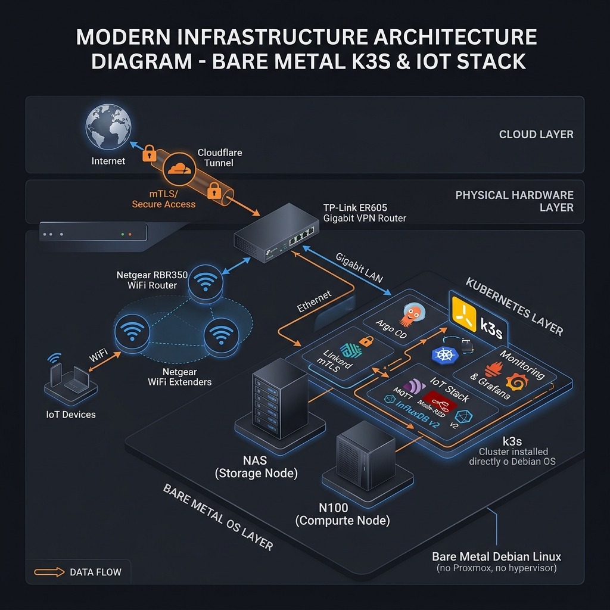

# 🏗️ Home Platform K8s Foundation

The control plane repository for the Home Platform. It manages the **Argo CD** root applications, the **Service Catalog** (Helm charts), and global platform policies.

## 🧭 1. Platform Core
This repo is responsible for the "Foundation" layer of the Kubernetes cluster:
- **GitOps**: Argo CD (Root App + ApplicationSets)
- **Service Mesh**: Linkerd (mTLS by default)
- **Ingress**: Traefik (with Authelia SSO)
- **Security**: Kyverno (Policy-as-Code) & ExternalSecrets
- **Monitoring**: Prometheus, Grafana, Loki, Tempo

---

## 🚀 2. Zero-to-Platform Setup

### Step 1: Install Argo CD
Bootstrap the GitOps engine.
```bash
kubectl create namespace argocd
kubectl apply -n argocd -f https://raw.githubusercontent.com/argoproj/argo-cd/stable/manifests/install.yaml
```

### Step 2: Deploy Root Application
Point Argo CD to this repository to start the automated rollout.
```bash
kubectl apply -f argocd/root-app.yaml
```

---

## 📁 3. Managed Service Catalog
All third-party services are managed as Helm charts in `managed-service-catalog/helm/`.

### Available Services:
- **EMQX**: HA MQTT Broker
- **Grafana**: Centralized dashboards (auto-provisioned)
- **Linkerd**: Service Mesh & mTLS
- **Kyverno**: Governance & Security Policies
- **Traefik**: Edge Router & Proxy

---

## 📊 4. Observability & Dashboards
Access the platform monitoring stack:
- **Grafana**: `https://grafana.yourdomain.com` (SSO via Authelia)
- **Argo CD UI**: `https://argocd.yourdomain.com`
- **Backstage**: `https://backstage.yourdomain.com`

---

## 🎨 Architecture


### Hardware Integration View

