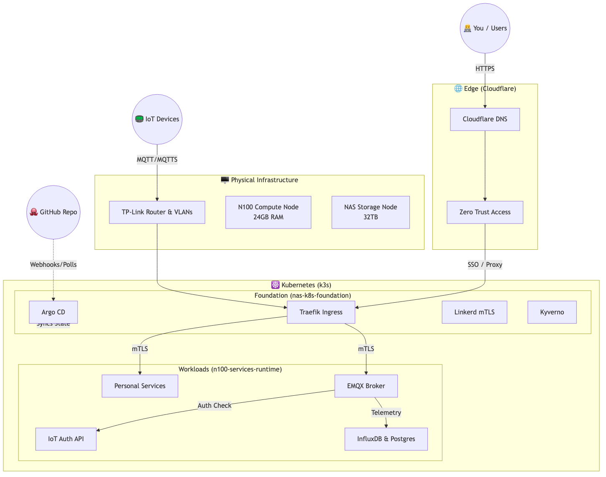

# 🏗️ Home Platform K8s Foundation

The control plane repository for the Home Platform. It manages the **Argo CD** root applications, the **Service Catalog** (Helm charts), and global platform policies.

## 📍 Where to Start

- **`argocd/`**: Contains the GitOps engine manifests, including the `root-app.yaml` that bootstraps the entire cluster.
- **`managed-service-catalog/`**: Contains Helm charts for all 3rd party infrastructure services (Traefik, EMQX, Linkerd, etc).
- **`docs/assets/`**: Contains the Platform Architecture Diagram (`architecture.png`).

## 🚀 How to Start (Zero-to-Platform Setup)

If you are bootstrapping the cluster from scratch, you must first install the GitOps engine.

**Step 1: Install Argo CD**
```bash
kubectl create namespace argocd
kubectl apply -n argocd -f https://raw.githubusercontent.com/argoproj/argo-cd/stable/manifests/install.yaml
```

**Step 2: Deploy Root Application**
Point Argo CD to this repository to start the automated rollout of all platform services.
```bash
kubectl apply -f argocd/root-app.yaml
```

*(Once the root app is deployed, Argo CD takes over and syncs everything else automatically).*

## 🏗️ What to Start (Day-to-Day)

When working in this repository, you are generally modifying the core platform:
- **Updating a core service version**: Edit the values in `managed-service-catalog/helm/template-library/` to bump a Helm chart version.
- **Adding a new platform tool**: Create a new application in `argocd/applications/` and add its chart to the catalog.
- **Viewing Dashboards**:
  - **Grafana**: `https://grafana.yourdomain.com` (SSO via Authelia)
  - **Argo CD UI**: `https://argocd.yourdomain.com`
  - **Backstage**: `https://backstage.yourdomain.com`

---

## 🧭 Platform Core Components

This repo is responsible for the "Foundation" layer of the Kubernetes cluster:
- **GitOps**: Argo CD (Root App + ApplicationSets)
- **Service Mesh**: Linkerd (mTLS by default)
- **Ingress**: Traefik (with Authelia SSO)
- **Security**: Kyverno (Policy-as-Code) & ExternalSecrets
- **Monitoring**: Prometheus, Grafana, Loki, Tempo

---

## 🎨 Architecture

