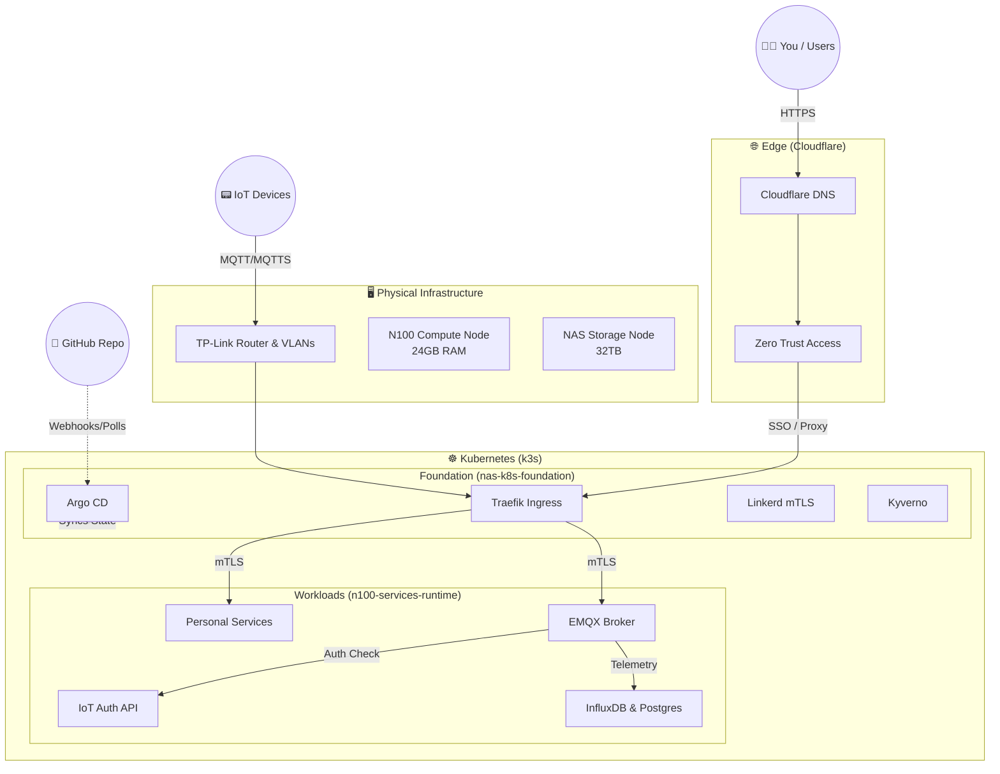

# 🎨 Platform Architecture

The architecture has been updated from static PNGs to dynamic Mermaid diagrams for easier maintenance.

## Full System Architecture

```mermaid
graph TD
    %% Define Edge & Identity
    subgraph Edge["🌐 Edge (Cloudflare)"]
        DNS[Cloudflare DNS]
        ZT[Zero Trust Access]
    end

    %% Define Home Network Hardware
    subgraph Hardware["🖥️ Physical Infrastructure"]
        Router[TP-Link Router & VLANs]
        N100[N100 Compute Node<br/>24GB RAM]
        NAS[NAS Storage Node<br/>32TB]
    end

    %% Define Kubernetes Platform
    subgraph K8s["☸️ Kubernetes (k3s)"]
        subgraph ControlPlane["Foundation (nas-k8s-foundation)"]
            Ingress[Traefik Ingress]
            GitOps[Argo CD]
            Mesh[Linkerd mTLS]
            Security[Kyverno]
        end

        subgraph Runtime["Workloads (n100-services-runtime)"]
            Auth[IoT Auth API]
            Broker[EMQX Broker]
            Data[InfluxDB & Postgres]
            CustomApps[Personal Services]
        end
    end

    %% Human vs Machine Actors
    Human((👨‍💻 You / Users))
    IoT((📟 IoT Devices))

    %% Connections
    Human -->|HTTPS| DNS
    IoT -->|MQTT/MQTTS| Router
    
    DNS --> ZT
    ZT -->|SSO / Proxy| Ingress
    
    Router --> Ingress
    Ingress -->|mTLS| Broker
    Ingress -->|mTLS| CustomApps
    
    Broker -->|Auth Check| Auth
    Broker -->|Telemetry| Data
    
    GitOps -.->|Syncs State| K8s
    GitHub((🐙 GitHub Repo)) -.->|Webhooks/Polls| GitOps
```
